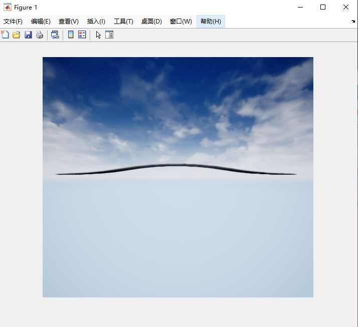

[](https://ww2.mathworks.cn/matlabcentral/fileexchange/100651-mexcmake)

# 基于CMake交叉编译C++得到适用与Matlab的Mex加速库文件

提供基于CMake的方式编译C++代码，代替mex函数打包，配置简单，通用，可修改，不依赖于特定的编译器，平台，工具IDE等，本示例展示了使用一个`readBinFile.cpp`文件如何通过交叉编译为对应平台的mex文件（即不同平台对应的库文件）。

## 编译后缀文件

- windows: *.mexw64
- Unix: *.mexa64
- Mac: *.mexmaci64

## Requirements

- desktop Matlab 2018a or later

## How to compile

```cmake
git clone https://github.com/cuixing158/MexCmake.git
cd MexCmake
mkdir build
cd build
cmake  ..
make 
```

Then copy "myGccMex" mex file to your `MexCmake/` working directory(current working directory).

## How to use mex file in matlab

Copy the mex file to the current working directory of matlab and execute the following statement to parse the image.

```matlab
outImg = myGccMex("dataImgUnrealori.bin");
imshow(outImg)
```


